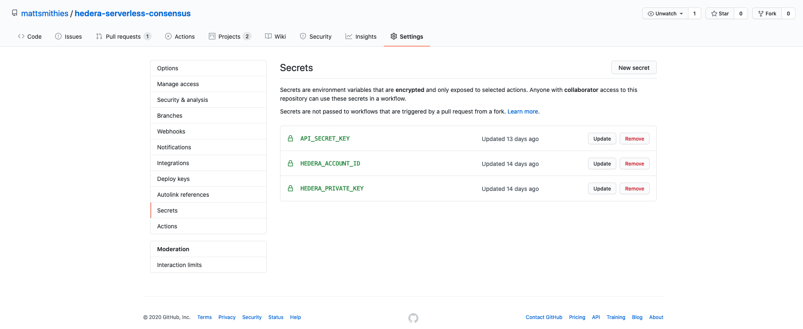

# Github Actions

## Why you should add this CI flow

Consider this process as an automated CI flow for verifying the stablity of your client against your configuration scheduled on a daily basis.

The benefit of setting up the github action flow is that it will check the lint and basic tests for the app.

As before add your esstiential environment variables to your Github 

* **HEDERA\_NETWORK**
* **HEDERA\_ACCOUNT\_ID**
* **HEDERA\_PRIVATE\_KEY**
* **API\_SECRET\_KEY**

You can update your secrets from your Github repository from **Settings -&gt; Secrets**.

If a job fails and you wish to re-run the job you can re-run all jobs from the **Actions** tab.

## Validating the live client is working as expected

When combined with the **APP\_URL** with the live **API\_SECRET\_KEY** the tests will check basic **free** routes of the client, this includes the end points for status and account balance.


If you are developing against previewnet or testnet it is possible that your account id will change in the hedera portal if testnet is reset in a fresh state in cases of extended downtime.


Ensure that these environment variables are added as secrets as before.

The scheduled CI Github action will run everyday and check that the external client has a valid configuration.


This will provide insight to whether configuration needs to be updated on your deployments, if the request to **/api/account/balance** fails with a status code **502**, it is likey that your **HEDERA\_ACCOUNT\_ID** on Vercel will need to be updated and the app redeployed.


